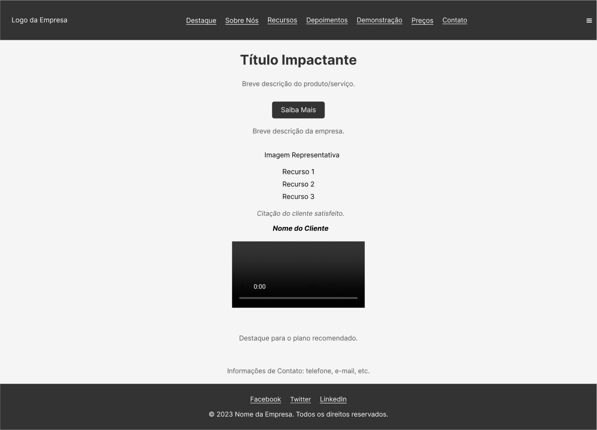

# Report on the Construction of the Landing Page and Figma Wireframe

## Introduction

The developed landing page aims to present a product or service impactfully, providing concise information about the company, highlighting features, customer testimonials, and encouraging users to contact or learn more about the product/service. The construction process involved creating a medium-fidelity wireframe in Figma, which served as a basis for implementation in HTML/CSS.

## Methods

### Figma Wireframe

The first step was to create a medium-fidelity wireframe using the Figma design tool. This wireframe defined the structure of the landing page, the positioning of elements, colors, and basic styles. During this phase, principles of user interface (UI) design were considered to ensure an intuitive and pleasant user experience.

### Implementation in HTML/CSS

Based on the wireframe, the next step was to translate the design into code. We used HTML to structure the page content and CSS to style and position the elements. Best practices in web development were applied, such as responsiveness for different screen sizes and optimization to ensure fast page loading.

## Results

The resulting landing page features a visually appealing and intuitive design. Sections are logically organized, with emphasis on the impactful title, company information, key features, customer testimonials, and a contact form. Responsiveness was implemented, ensuring a consistent experience across various devices.

The Figma wireframe was crucial for the project's success, providing a clear view of the structure before implementation. The transition from Figma to code was smooth, with the wireframe serving as a guide for development.

## Conclusion

The construction of the landing page was successful, resulting in a visually attractive and functional project. The use of Figma to create the wireframe provided a clear vision of the design before implementation, saving time and facilitating collaboration among team members. The web development approach used demonstrates the practical application of design and coding concepts to create an engaging user experience.

## Use Case

**Use Case: XYZ Technology Company - Launch of a New Product**

The landing page was developed for XYZ Technology Company as part of the launch of a new product. The page serves as a central point for potential customers to gather information about the product, explore its features, and contact the company. The integrated contact form facilitates lead generation, while customer testimonials highlight user satisfaction.

The modern and responsive design of the landing page reflects the innovative image of the company, contributing to the success of the product launch and increasing XYZ's online visibility.

This report highlights the importance of an integrated approach to design and development to create an effective and engaging online presence.

# Landing Page

## Header
- Soon
- Navigation menu

## Featured Section
- Impactful title
- Brief description of the product/service
- Call to action (CTA) button

## About Us
- Brief description of the company
- Representative image

## Key Features
- Feature list
- Icons or illustrative images

## Depositions
- Quotes from satisfied customers
- Photos and names of customers

## Demonstration
- Video or GIF showing the product/service in action

## Pricing Plan
- Table with different plans and prices
- Highlight the recommended plan

## Contact
- Contact Form
- Contact information (phone, email)

## Baseboard
- Links to social networks
- Useful links
- Copyright information

