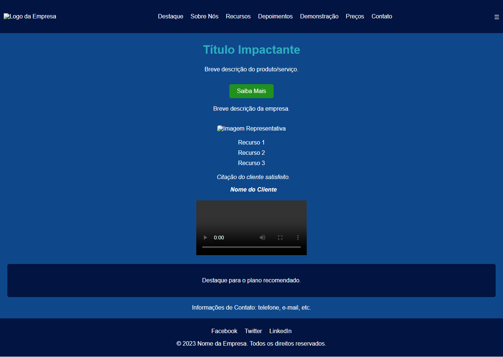

# Design System Development Report Using Figma

## 1. Introduction

The design system is a structured and consistent approach to user interface development, aiming to create a cohesive and efficient experience for end-users. In this report, we will describe the developed design system, emphasizing the importance of a unified methodology in interface creation.

## 2. Methods

The design system development process was conducted using the Figma tool, a collaborative design platform. Initially, basic interface elements, or "atoms," such as buttons, input fields, colors, and typography, were identified. These elements were organized and cataloged to form a cohesive set of "molecules" and "organisms," encompassing more complex components.

The adopted methodology was iterative, allowing constant review and refinement of the design system as new components and patterns were added. Effective collaboration between designers and developers was facilitated by Figma, enabling simultaneous creation and real-time visualization of changes.

## 3. Results

The resulting design system features a modular and reusable structure, providing visual consistency throughout the project. Each element, from atoms to complete pages, follows the defined design guidelines, streamlining the development process and enhancing team efficiency.

A specific use case involves creating a user profile page. Atoms, such as buttons and input fields, were combined to form molecules (e.g., a profile editing form) and organisms (the complete profile page). The color palette, inspired by jewel tones, was consistently applied, providing a visually pleasing and unique aesthetic.

## 4. Conclusion

Developing a design system using Figma proved crucial in ensuring consistency, efficiency, and effective collaboration among team members. The modular approach allowed easy expansion of the system as the project evolved. The Figma tool played a fundamental role, enabling instant visualization of changes, accelerating the design and development process.

The specific use case demonstrates the practical applicability of the design system, highlighting how modular elements can be combined to efficiently create complex interfaces.

In summary, the developed design system provided significant benefits in visual cohesion, development efficiency, and effective collaboration, illustrating the importance of this approach in creating high-quality user experiences.

